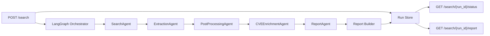

# Cyber Threat Intelligence Agent System

A multi-agent system that discovers cybersecurity incidents from the open web, extracts structured intelligence, enriches referenced CVEs via the NVD API, and serves a consolidated threat report through a REST API.

## Architecture



The pipeline is modeled as a **LangGraph `StateGraph`** — a directed acyclic graph with explicit state transitions between agents. Each agent is a separate class with a single `run()` method, invoked as a graph node. The orchestrator passes a shared typed state dict (`AgentState`) through the graph; each node reads from and writes to well-defined keys.

### Agent responsibilities

| Agent | Input | Output | Role |
|---|---|---|---|
| **SearchAgent** | User query + time range | `list[SearchResult]` | Discovers candidate articles via DuckDuckGo HTML search and Google News RSS. Hydrates articles in parallel (`ThreadPoolExecutor`), scores relevance, and post-filters by `TimeWindow`. |
| **ExtractionAgent** | Raw search results | `list[Incident]` | Converts unstructured text into structured incident records. LLM path (Claude with one-shot prompt) or regex-based heuristic fallback. Parallel via thread pool. |
| **PostProcessingAgent** | Raw incidents + query | `list[Incident]` (cleaned) | Title normalization, CVE noise filtering, deduplication, query-token relevance gating. |
| **CVEEnrichmentAgent** | Incidents with CVE IDs | `list[Vulnerability]` | Queries NVD API for each unique CVE with rate pacing and response caching. |
| **ReportAgent** | Incidents + vulnerabilities | Analysis dict | Synthesizes executive summary, key findings, recommendations. LLM or heuristic. |

A final **Report Builder** step assembles the JSON/Markdown report, hydrates incident-level CVE references, computes quality metrics, runs the evaluation harness, and attaches pipeline telemetry.

### Async execution model

FastAPI endpoints are async. The orchestrator pipeline runs as a background task via `asyncio.create_task`. Agents use synchronous HTTP (`httpx.Client`). This is safe because LangGraph's `ainvoke()` dispatches sync node functions into a **thread-pool executor**, so blocking I/O does not stall the event loop.

This is a deliberate trade-off: fully async agents would be architecturally cleaner, but sync agents are simpler to test, debug, and compose with `ThreadPoolExecutor` fan-out inside stages. The thread-pool dispatch eliminates the practical risk.

### Retry and fault tolerance

Two-level retry strategy:

1. **HTTP client** (`app/clients.py`): up to 3 retries on transient errors (429/5xx, timeouts, connection failures) with exponential backoff and jitter.
2. **Orchestrator node** (`app/orchestrator.py`): 1 additional attempt per agent node, **only for transient/transport errors** (`httpx.TimeoutException`, `ConnectError`, `OSError`, etc.). Deterministic failures (parse errors, schema errors, bad data) degrade immediately without wasting a retry. Degraded nodes return safe fallbacks and record warnings.

### Per-node telemetry

Every agent node records:

| Field | Description |
|---|---|
| `started_at` / `finished_at` | Wall-clock timestamps |
| `duration_ms` | Execution time in milliseconds |
| `items_in` / `items_out` | Throughput |
| `attempt` | Which attempt succeeded |
| `degraded` | Whether the node fell back |
| `error` | Error message if degraded |

Telemetry is attached to the report JSON and rendered in the Markdown summary and Streamlit UI.

### Caching

In-memory TTL caches reduce redundant external calls:

- **NVD cache** (`24h TTL`): avoids re-fetching the same CVE across runs or within a single run with overlapping incidents.
- **LLM cache** (`1h TTL`): keyed by `sha256(model + system_prompt + user_prompt)`, avoids paying for identical extraction or synthesis prompts.

Both caches use a thread-safe `SimpleCache` with per-key expiry. Production would swap to Redis; the interface is intentionally narrow.

### Incident ↔ CVE linkage

The global vulnerability registry (`Report.vulnerabilities`) is preserved for deduplicated reporting. Additionally, each incident carries `related_vulnerabilities: list[IncidentCVERef]` — lightweight enriched references embedded directly inside the incident. This matches the expected output format from the assignment and makes incident-to-vulnerability inspection straightforward without cross-referencing.

## Design decisions

**Why LangGraph.** The pipeline is a linear DAG today, but LangGraph supports conditional edges, parallel fan-out, and human-in-the-loop checkpoints with minimal refactoring. The `StateGraph` provides typed state, explicit edge definitions, and async execution with thread-pool dispatch.

**Why five agents instead of three.** PostProcessingAgent and ReportAgent address real failure modes (noisy CVEs, duplicate incidents, site-name suffixes in titles, need for narrative synthesis separate from mechanical assembly). Removing them measurably degrades report quality.

**Separate LLM models.** Extraction uses `claude-haiku-4-20250414` (cheap, fast, good enough for structured extraction). Report synthesis uses `claude-sonnet-4-20250514` (stronger reasoning for narrative quality). Configurable via env.

**Time range handling.** Parsed into a `TimeWindow(start, end)` — a half-open interval. `"2023"` becomes `[2023-01-01, 2024-01-01)`, not `[2023-01-01, ∞)`. `"last 2 years"` becomes `[now-2y, None)`. Applied both as a query-level hint (appended to search terms) and as a post-filter on `published_at` with timezone normalization (naive datetimes treated as UTC).

**In-memory run store.** MVP for simplicity. Not durable across process restarts. Does not support multi-worker deployments. Production would use Redis or Postgres. The async interface (`InMemoryRunStore`) makes the swap a single-file change.

**Single HTTP client.** All outbound HTTP goes through `app/clients.py` — an `httpx.Client` wrapper with retry/backoff. No mixed urllib/httpx.

## Project structure

```
├── app/
│   ├── agents/
│   │   ├── search.py          # Web discovery, parallel hydration, TimeWindow
│   │   ├── extraction.py      # LLM / heuristic extraction, parallel
│   │   ├── postprocess.py     # Normalization, dedup, relevance
│   │   ├── enrichment.py      # NVD enrichment with cache + rate pacing
│   │   └── report.py          # LLM / heuristic synthesis
│   ├── cache.py               # In-memory TTL cache (NVD + LLM)
│   ├── clients.py             # httpx HTTP client with retry/backoff
│   ├── config.py              # Settings from env (dotenv support)
│   ├── evaluation.py          # Gold-query evaluation harness
│   ├── llm.py                 # LLM abstraction with lazy import + cache
│   ├── logging_utils.py       # Structured JSON logging
│   ├── main.py                # FastAPI app and async run lifecycle
│   ├── models.py              # Pydantic models (incl. NodeTelemetry, IncidentCVERef)
│   ├── orchestrator.py        # LangGraph DAG, telemetry, transient-only retry
│   ├── reporting.py           # Report builder, CVE hydration, Markdown
│   └── store.py               # In-memory run store
├── ui/
│   └── app.py                 # Streamlit user interface
├── tests/                     # 42 tests, all run without network/API keys
├── examples/
│   ├── eval_dataset.json      # Gold-query evaluation profiles
│   ├── sample_report.json     # Example JSON output
│   └── sample_report.md       # Example Markdown output
├── Dockerfile
├── docker-compose.yml         # API + UI services
├── requirements.txt
├── pytest.ini
├── .env.example
└── README.md
```

## API

### `POST /search`

```json
{
  "query": "ransomware attacks healthcare sector",
  "time_range": "last 2 years",
  "max_articles": 5
}
```

Response (`202 Accepted`):

```json
{ "run_id": "uuid", "status": "PENDING" }
```

### `GET /search/{run_id}/status`

Returns `PENDING`, `RUNNING`, `COMPLETED`, or `FAILED`.

### `GET /search/{run_id}/report`

Final JSON report including `incidents` (with `related_vulnerabilities`), `vulnerabilities`, `pipeline_telemetry`, and `warnings`. Returns `404` / `409` as appropriate.

### `GET /health`

Liveness probe.

## Setup

### Local

```bash
python3 -m venv .venv
source .venv/bin/activate
pip install -r requirements.txt
cp .env.example .env
# Add your ANTHROPIC_API_KEY to .env (optional — heuristic fallback works without it)
uvicorn app.main:app --reload
```

In a second terminal:

```bash
streamlit run ui/app.py
```

### Docker

```bash
cp .env.example .env
# Edit .env with your API key if desired
docker compose up --build
```

API: `http://localhost:8000` · UI: `http://localhost:8501`

### Tests

```bash
pytest
```

All tests run without network access or API keys.

### Quick API test with curl

```bash
# Submit a search
curl -s -X POST http://localhost:8000/search \
  -H 'Content-Type: application/json' \
  -d '{"query": "MOVEit vulnerability exploitation", "max_articles": 3}'
# → {"run_id": "...", "status": "PENDING"}

# Poll status (replace RUN_ID)
curl -s http://localhost:8000/search/RUN_ID/status
# → {"run_id": "...", "status": "COMPLETED", ...}

# Retrieve report
curl -s http://localhost:8000/search/RUN_ID/report | python3 -m json.tool
```

## Configuration

| Variable | Default | Purpose |
|---|---|---|
| `ANTHROPIC_API_KEY` | — | Enables LLM extraction and synthesis |
| `ANTHROPIC_EXTRACTION_MODEL` | `claude-haiku-4-20250414` | Model for structured extraction (cheap) |
| `ANTHROPIC_REPORT_MODEL` | `claude-sonnet-4-20250514` | Model for report synthesis (strong) |
| `ANTHROPIC_BASE_URL` | — | Custom API endpoint |
| `OLLAMA_BASE_URL` | `http://127.0.0.1:11434` | Ollama server URL |
| `OLLAMA_MODEL` | — | Enables Ollama |
| `DEFAULT_MAX_ARTICLES` | `5` | Default article limit |
| `MAX_LLM_CHARS_PER_ARTICLE` | `8000` | Prompt budget per article |
| `REQUEST_TIMEOUT_SECONDS` | `20` | HTTP timeout |

## Known limitations and trade-offs

- **Web discovery.** DuckDuckGo HTML scraping and Google News RSS are free but brittle. Compensated by dual-source fault isolation and relevance filtering.
- **Article parsing.** Regex-based HTML extraction misses JS-rendered or paywalled content.
- **Heuristic extraction.** Conservative; organization extraction is the weakest field. LLM path substantially improves all fields.
- **NVD rate limits.** 1-second delay between requests (NVD: 5 req/30s without key). NVD API key support would reduce this.
- **In-memory store.** Not durable across restarts, not multi-worker safe.
- **In-memory cache.** Same caveats; Redis would be the production replacement.

## What I would improve with more time

1. **CISA KEV integration** — flag CVEs in the Known Exploited Vulnerabilities catalog.
2. **Fully async agents** — `httpx.AsyncClient` for concurrent fetching within nodes.
3. **Redis-backed store + cache** — durability and multi-worker support.
4. **OpenTelemetry tracing** — per-agent spans; the current `pipeline_telemetry` is a lightweight substitute.
5. **LLM call gating** — skip LLM when heuristics extract sufficient fields, reducing cost.
6. **Richer evaluation** — larger gold dataset, CI regression runs.

## Example output

Sample artifacts: `examples/sample_report.json` and `examples/sample_report.md`.
